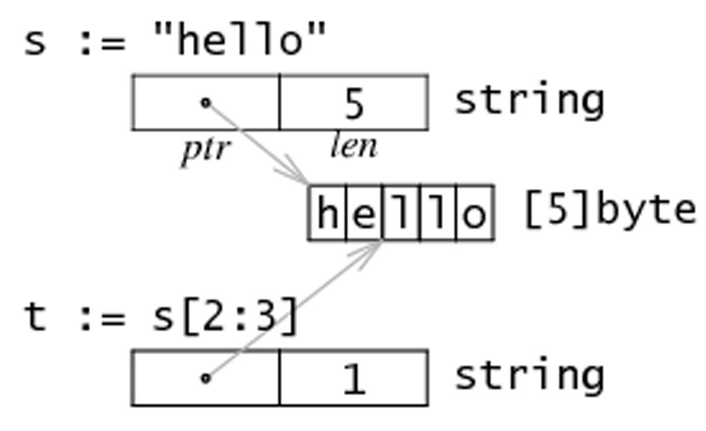

字符串，数组和切片的应用
-

###从字符串生成字节切片
  
假设 s 是一个字符串（本质是一个字节数组），那么就可以直接通过`c := []byte(s)` 来获取一个字节数组的切片 c    
还可以通过copy函数来获取： `copy(dst []byte, src string`   
同样，也可以用for-range 来获得每个元素：  
[for_string_test.go](study_source/slice_04/for_string_test.go)    
```go
package slice_04

import "testing"

func TestForString(t *testing.T)  {
    s := "\u00ff\u754c"
	for i, c := range s {
		t.Logf("%d:%c",i,c)
    }
}
```   
Unicode 字符会占用两个字节，有些甚至需要三个或者四个字节来表示。如果发现错误的UTF-8字符，则该字符会被设置为 U+FFFD 并且索引向前移动一个字节。   
和字符串转换一样，可以使用`c := []int32(s)` 这样切片中的每个int 都会包含对应的 Unicode 代码，因为字符串中的每次字符都会对应一个整数。   
类似的，也可以将字符串转换为元素类为 rune 的切片 ：`r := []rune(s)`   
可以通过代码 `len([]int32(s))` 来获得字符串中字符的数量，使用 `utf8.RuneCountInString(s)` 效率更高    
还可以将一个字符串追加到某一字符数组的尾部  
```go
var b []byte
var s string
b = append(b,s...)
```    

###获取字符串的某一部分

使用`substr := str[start:end]` 可以从字符串 str 获取到从索引 start 开始到 end-1 的位置的子字符串   
同样，str[start:] 则表示获取从 start 开始到 len(str)-1 位置的子字符串。而 str[:end] 表示获取从0开始到 end-1 的子字符串     

###字符串和切片的内存结构

在内存中，一个字符串实际上是一个双字结构，即一个指向实际数据的指针和记录字符串长度的整数。   
因为指针对用户来说是完全不可见，因此可以依旧把字符串看做是一个值类型，也就是一个字符数组。   
字符串 `string s = "hello" ` 和子字符串 `t = s[2:3]` 在内存中的结构如下：   

   

###修改字符串中的某个字符

Go语言中的字符串是不可变的，也就是说 `str[index]` 这样的表达式是不可以被放在等号左侧    
如果运行 `str[i] = 'D'` 会得到错误 `cannot assign to str[i]` 

因此，必须先将字符串转换为字节数组，然后再通过修改数组中的元素值来达到修改字符串的目的，最后再将字节数组换回字符串格式：
ex:
```go
s := "hello"
c := []byte(s)
c[0] = "c"
s2 := string(c) // s2 == "cello"
```   
所以通过操作切片来完成对字符串的操作    

###字节数组对比函数  
下面例程中的 `Compare` 函数会返回两个字节数组字典顺序的整数对比结果，即 `0 if a == b, -1 if a < b, 1 if a > b`    
```go
func Compare(a, b[]byte) int {
	for i := 0; i < len(a) && i < len(b); i++ {
		switch {
		case a[i] > b[i]:
			return 1
        case a[i] < b[i]:
			return -1
        }
    }
	// 数组的长度可能不同
	switch {
	case len(a) < len(b):
		return -1
	case len(a) > len(b):
		return 1
    }
	return 0 // 数组相等
}
```   

###搜索及排序切片和数组
标准库提供了 `sort` 包来实现常见的搜索和排序操作。可以使用`sort` 包中的函数 `func Ints(a []int)` 来实现对int类型切片的排序   
ex: `sort.Ints(arri)`，其中变量arri就是需要被升序排序的数组或切片。   
为了检查某个数组是否已经被排序，可以通过函数`IntAreSorted(a []int) bool ` 来检查，如果返回值为true，则表示已经被排序    
类似的，可以使用函数`func Float64s(a []float64)` 来排序 float64 的元素，或者使用函数 `func Strings(a []string)` 排序字符串元素    
想要在数组或切片中搜索一个元素，该数组或切片必须先被排序（因为标准库的搜索算法使用的是二分法）。 然后，可以使用函数 `func SearchInts(a []int, n int) int`    
进行搜索，并返回对应结果的索引值。   
也可以搜索float64 和 字符串：   
    
    func SearchFloat64s(a []float64, x float64) int 
    func SearchStrings(a []string, x string) int

这里是使用 sort 包进行切片的排序和搜索    

###append函数的常见操作

append函数主要功能：  

    1.将切片 b 的元素追加到 a 之后： a = append(a, b...)  
    2.复制切片 a 的元素到新的切片 b 上： b = make([]T, len(a))   copy(b,a)   
    3.删除位于索引 i 的元素： a = append(a[:i], a[i+1:]...)   
    4.切除切片 a 中从索引 i 到 j 位置的元素： a = append(a[:i], a[j:]...)    
    5.为切片 a 扩展 j 个元素长度： a = append(a, make([]T, j)...)    
    6.在索引 i 的位置插入元素 x : a = append(a[:i], append([]T{x}, a[i:]...)...)
    7.在索引 i 的位置插入长度为 j 的新切片： a = append(a[:i], append(make([]T, j), a[i:]...)...) 
    8.在索引 i 的位置插入切片 b 的所有元素：a = append(a[:i], append(b, a[i:]...)...)
    9.取出位于切片 a 最末尾的元素 x：x, a = a[len(a)-1:], a[:len(a)-1]
    10.将元素 x 追加到切片 a：a = append(a, x)   
因此，可以使用切片和 append 操作来表示任意可变长度的序列。   
从数学角度来看，切片相当于向量，如果需要的话可以定义一个向量来作为切片的别名来进行操作。   

###切片和垃圾回收

切片的底层指向一个数组，该数组的实际容量可能要大于切片所定义的容量。只有在没有任何切片指向的时候，底层的数组内存才会被释放，这种特性有时会导致程序占用多余内存。   

ex：示例函数 `FindDigits` 将一个文件加载到内存，然后搜索其中所有的数字并返回一个切片   
```go
var digitRegexp = regexp.MustCompile("[0-9]+")

func FindDigits(filename string) []byte {
	b, _ := ioutil.ReadFile(filename)
	return digiRegexp.Find(b)
}
```    
这段代码可以顺利运行，但是返回的`[]byte`指向的底层是整个文件的数据，只要该返回的切片不被释放，垃圾回收器就不能释放整个文件所占用的内存，即，一点点有用的数据占用了整个文件的内存。    
想要避免这个问题，可以通过拷贝所需要的部分到一个新的切片中：   
```go
func FindDigits(filename string) []byte {
	b, _ := ioutil.ReadFile(filename)
	b = digitRegexp.Find(b)
	c := make([]byte, len(b))
	copy(c,b)
	return c
}
```
这段代码只能找到第一个匹配的正则表达式的数字串。想要找到所有的数字，可以下面这个代码：   
```go
func FindFileDigits(filename string) []byte {
	fileBytes, _ := ioutil.ReadFile(filename)
	b := digitRegexp.FindAll(fileBytes, len(fileBytes))
	c := make([]byte,0)
	for _, bytes := range b {
	    c = append(c, bytes...)	
    }
	return c
}
```


